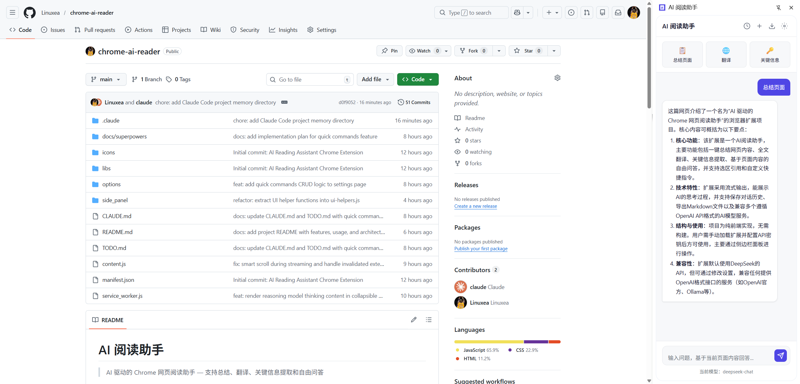

# AI 阅读助手

> AI 驱动的 Chrome 网页阅读助手 — 支持总结、翻译、关键信息提取和自由问答



## 功能特性

- **一键总结** — 快速生成网页内容摘要，3-5 个要点概括核心信息
- **全文翻译** — 将外文网页翻译为中文，专业术语保留英文并附注释
- **关键信息提取** — 自动提取网页中的重要事实、数据和观点
- **自由问答** — 基于当前页面内容进行多轮对话问答
- **选区引用** — 选中页面文字后自动预览，发送时引用上下文精准提问
- **自定义指令** — 在设置中配置快捷指令，输入 `/` 即可快速调用
- **流式输出** — 实时显示 AI 回复，支持推理模型的思考过程展示
- **对话历史** — 自动保存聊天记录（最多 50 条），支持回看和继续对话
- **导出 Markdown** — 将对话记录导出为格式化的 Markdown 文件
- **多模型支持** — 兼容所有 OpenAI API 格式的服务端点，可自动获取模型列表

## 安装使用

### 安装

1. 打开 Chrome，访问 `chrome://extensions/`
2. 开启右上角 **开发者模式**
3. 点击 **加载已解压的扩展程序**
4. 选择本项目目录

### 配置

1. 点击扩展图标打开侧边栏，点击右上角齿轮进入设置
2. 填入 **API Key**（必填）
3. **API 地址**（可选）— 默认为 `https://api.deepseek.com`，可替换为任何 OpenAI 兼容接口
4. **模型名称**（可选）— 默认 `deepseek-chat`，可点击刷新按钮获取可用模型列表
5. **自定义 System Prompt**（可选）— 追加到默认提示词后，个性化 AI 回答风格

### 使用

- 点击工具栏扩展图标打开侧边面板
- 使用顶部快捷按钮（总结 / 翻译 / 关键信息）快速操作
- 在输入框输入问题进行自由问答
- 在页面中选中文字，侧边栏会显示引用预览，发送时自动附带引用上下文
- 输入 `/` 触发快捷指令菜单

## 项目结构

```
chrome-ai-reader/
├── manifest.json              # 扩展配置（Manifest V3）
├── service_worker.js          # 后台服务：API 调用、消息中转
├── content.js                 # 内容脚本：页面提取、选区监听
├── side_panel/
│   ├── side_panel.html        # 侧边栏界面
│   ├── side_panel.css         # 样式（CSS 自定义属性主题）
│   └── side_panel.js          # 交互逻辑：聊天、历史、导出
├── options/
│   ├── options.html           # 设置页面
│   ├── options.css            # 设置页样式
│   └── options.js             # 设置逻辑：配置管理、模型列表、快捷指令
├── libs/
│   ├── Readability.js         # Mozilla Readability 页面正文提取
│   └── marked.min.js          # Markdown 渲染
└── icons/                     # 扩展图标（16/48/128px）
```

## 技术实现

### 架构概览

无构建系统、无框架依赖，所有文件由 Chrome 直接加载。

```
用户操作 (side_panel.js)
  → chrome.tabs.sendMessage → content.js (Readability 提取页面)
  → chrome.runtime.connect (长连接) → service_worker.js
  → fetch OpenAI 兼容 API (流式 SSE)
  → port.postMessage 回传 → side_panel.js 渲染
```

### 核心通信机制

| 通道 | 方式 | 用途 |
|------|------|------|
| AI 对话 | `chrome.runtime.connect` 长连接端口 | 流式传输 AI 回复（chunk/done/error） |
| 页面提取 | `chrome.tabs.sendMessage` 一次请求 | 获取当前页面正文内容 |
| 选区中转 | `chrome.runtime.sendMessage` 一次请求 | 页面选区文字经 service worker 中转到侧边栏 |
| 模型列表 | `chrome.runtime.sendMessage` 一次请求 | 设置页通过 service worker 代理 API 请求（规避 CORS） |

### 兼容的 API 服务

默认使用 DeepSeek，但兼容所有 OpenAI API 格式的服务，包括但不限于：

- DeepSeek (`https://api.deepseek.com`)
- OpenAI (`https://api.openai.com/v1`)
- 其他 OpenAI 兼容接口（如 Ollama、vLLM 等）

只需在设置中修改 API 地址和模型名称即可切换。

## 开发

本项目无构建步骤，编辑文件后在 `chrome://extensions/` 页面点击刷新按钮即可生效。

## 许可证

MIT
