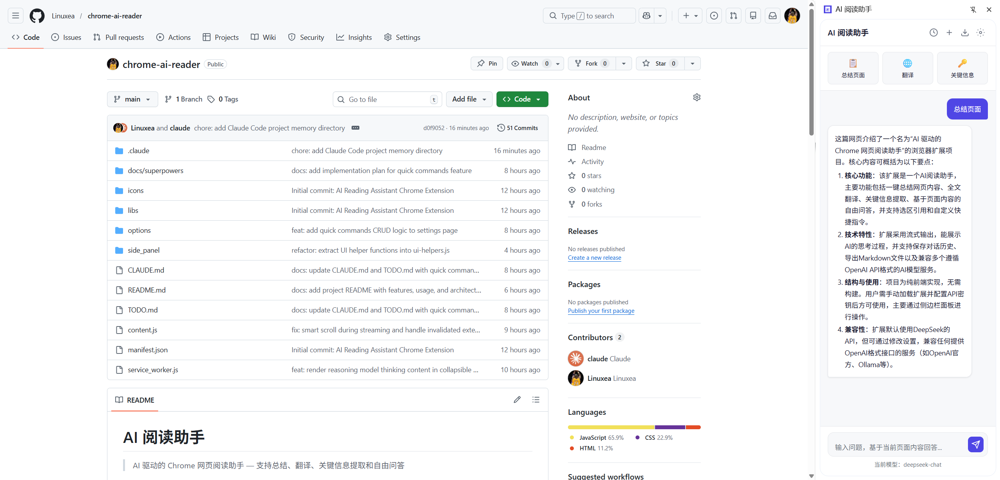

# 小🍐子阅读助手

> 贴身的 AI 网页阅读伙伴 — 让任何网页都能被读懂、被追问、被收藏

打开任意网页，点一下扩展图标，小🍐子就会出现在侧边栏里陪你读：总结全文、翻译外文、提取要点、回答追问；看到图表能帮你读出数据；看到值得推敲的句子能给出批判视角；读完一篇还能自动推荐你接下来该看什么。

## 亮点

- **零摩擦** — 不用复制粘贴，打开网页就能问
- **多模型自由切换** — 兼容所有 OpenAI 协议的服务（DeepSeek / OpenAI / Ollama / vLLM…），你的 Key 你做主
- **看得见的推理** — 支持展示推理模型的思考过程，回答有据可循
- **不只是聊天** — 总结、翻译、关键信息、图表分析、深度批阅、播客，每种阅读姿势都有
- **越用越懂你** — 自动记录你读过的页面，跨页面建立知识关联
- **中英双语 + 三种主题** — 界面随你心情换装

## 功能一览

### 阅读助手
- **一键总结** — 3-5 个要点概括网页或选区核心
- **全文翻译** — 外文网页一键中文化，专业术语保留英文并附注释
- **关键信息提取** — 自动列出文章里的事实、数据与观点
- **自由问答** — 基于当前页面内容的多轮对话
- **推理过程** — 可折叠展示推理模型的思考链路

### 深度阅读
- **大纲生成** — 自动产出结构化大纲，点击条目快速跳转
- **图表分析** — 自动扫描页面上的 Canvas / SVG / 图片图表，提取数据表格、计算统计指标（均值/最值/增长率）、生成数据洞察，支持导出 CSV / JSON
- **深度批阅** — 对页面中的关键句子自动生成三类深度标注：**批判**（指出论点风险）、**反方**（给出对立观点）、**漏洞**（挑逻辑毛病）。每条标注可一键带入对话继续追问
- **相关阅读** — 你读过的每一页都会被自动建索引，下次访问相似主题时，侧边栏底部会浮现"相关阅读"卡片，帮你顺藤摸瓜

### 输入与引用
- **选区引用** — 选中网页文字后自动捕获，所有快捷操作切换为针对选区处理
- **图片识别（OCR）** — 粘贴或拖拽图片到聊天框，自动识别文字
- **快捷指令** — 输入 `/` 召唤自定义指令，支持键盘上下选择

### 输出与回放
- **流式输出** — 实时显示 AI 回复，长答案不再干等
- **TTS 语音朗读** — 一键朗读 AI 回复（火山引擎语音），支持自动接龙
- **播客生成** — 把网页内容变成两位主持人对话形式的音频，适合通勤听
- **消息重试 / 复制** — 不满意就重抽，喜欢就复制

### 记忆与管理
- **对话历史** — 自动保存最近 50 条对话，可回看、继续、删除
- **导出 Markdown** — 把对话导出为带元信息的 .md 文件
- **设置导入/导出** — 一键备份所有配置，换机无忧

### 外观
- **三种主题** — 素笺（暖棕）、海洋（冷蓝）、森林（自然绿）
- **深色模式** — 一键切换日夜
- **中英双语** — 界面语言实时切换

## 安装

1. 在 Chrome 浏览器访问 `chrome://extensions/`
2. 打开右上角的 **开发者模式**
3. 点击 **加载已解压的扩展程序**，选择项目的 `dist/` 目录
4. 工具栏会出现小🍐子图标，点击即可在任意网页打开侧边栏

> 想自己构建？项目根目录执行 `npm install && npm run build`，产物就在 `dist/`。

## 配置

点侧边栏右上角的齿轮进入设置页。

### 必填（否则功能不可用）
- **API Key** — 任意 OpenAI 兼容服务的密钥
- **API 地址** — 默认 `https://api.deepseek.com`，可换成 OpenAI、Ollama、自建 vLLM 等
- **模型名称** — 默认 `deepseek-chat`，可点刷新按钮自动拉取可用模型列表

### 可选增强
| 功能 | 需要配置 | 解锁的能力 |
|------|---------|-----------|
| **自定义 System Prompt** | 填入个性化提示词 | 调整 AI 回答风格 |
| **TTS 语音朗读** | 火山引擎 TTS 凭证 | 朗读回复、自动接龙 |
| **OCR 图文识别** | 智谱 AI API Key | 图片文字识别、图表分析 |
| **播客生成** | 火山引擎 TTS 凭证 + 本地代理 | 网页→双人对话音频 |
| **相关阅读** | Embedding API（独立配置） | 跨页面知识关联推荐 |
| **推荐追问** | 开关 | AI 回复后自动建议 3 个追问 |

> **播客功能**因浏览器限制需要本地代理服务器：进入 `proxy/` 目录执行 `npm install && npm start`，代理会在 `localhost:3456` 启动。
>
> **相关阅读**的 Embedding 服务必须独立配置（不复用聊天 API），否则侧边栏会显示"未配置"提示。

## 使用

| 想做什么 | 怎么做 |
|---------|--------|
| 总结当前页 | 点击侧边栏 **总结** 按钮 |
| 翻译当前页 | 点击 **翻译** 按钮 |
| 提取要点 | 点击 **关键信息** 按钮 |
| 分析图表 | 点击 **图表** 按钮（自动扫描页面图表） |
| 深度批阅 | 点击 **深度批阅** 按钮，等待标注出现 |
| 生成播客 | 点击 **播客** 按钮 |
| 针对选区操作 | 在网页中选中文字 → 快捷按钮自动切换为处理选区 |
| 自由提问 | 在输入框输入问题，回车发送 |
| 召唤快捷指令 | 输入 `/`，上下键选择 |
| 重抽回复 | 点用户消息上的刷新按钮 |
| 朗读回复 | 点 AI 消息上的播放按钮 |
| 查看历史 | 点右上角时钟图标 |
| 切主题/语言 | 进入设置页 |

## 兼容性

- Chrome / Edge / 其他 Chromium 内核浏览器（需支持 Manifest V3 与 Side Panel）
- 兼容所有 OpenAI 协议的 LLM 服务端点

## 反馈

遇到问题或有想法？欢迎在仓库提 issue。

## 许可证

MIT
